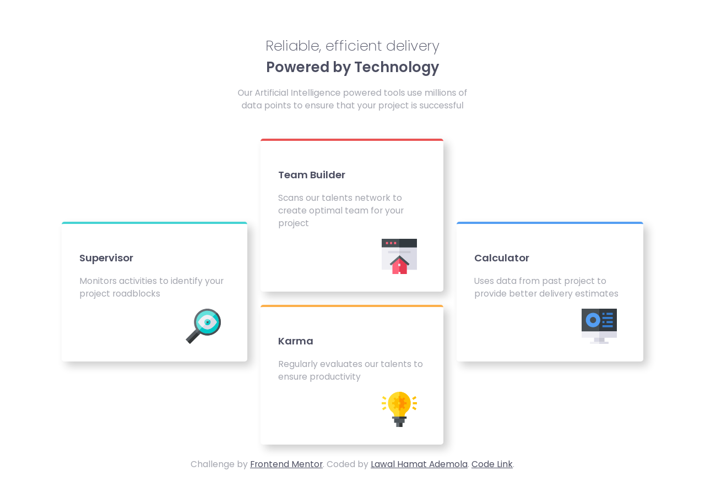

# Frontend Mentor - Stats preview card component solution

This is a solution to the [ Four card feature section challenge on Frontend Mentor](https://www.frontendmentor.io/challenges/four-card-feature-section-weK1eFYK) by me.
My aim is to use this project to show my front end skill 

## Table of contents
  
  - [The challenge](#the-challenge)
  - [Screenshot](#screenshot)
  - [Links](#links)
  - [Built with](#built-with)
  - [Author](#author)
  - [Acknowledgments](#acknowledgments)

### The challenge

Users should be able to:

- View the optimal layout depending on their device's screen size

### Screenshot

### Links

- [Code URL](https://github.com/EngineerHamziey/Solution-to-four-card-feature-section-master.git)
- [Live Site URL](https://engineerhamziey-four-card-feature.netlify.app/)
- [Solution Page On Frontend Mentor](https://www.frontendmentor.io/solutions/engineerhamziey-four-card-feature-solution-yr-7MMsNV-)

### Built with

- Semantic HTML5 markup(Enabling Good Accessibity To Help Assistive Technology Users )
- CSS custom properties
- CSS Grid
- Mobile-first workflow

## Author

- LinkedLn Profile - [Lawal Hamzat Ademola](https://www.linkedin.com/in/hamzat-lawal-a88404239)
- Frontend Mentor - [@EngineerHamziey](https://www.frontendmentor.io/profile/EngineerHamziey)
- E-Mail- [mrlawalhamzat@gmail.com](mrlawalhamzat@gmail.com)

## Acknowledgments
Thanks to [Frontend Mentor](https://www.Frontendmentor.io) for giving us the opportunity to show our frontend skills, practice to become better and Meet other developers.